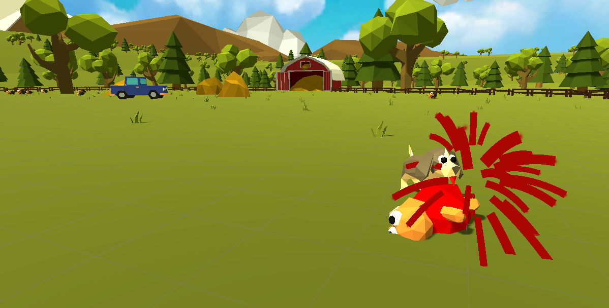
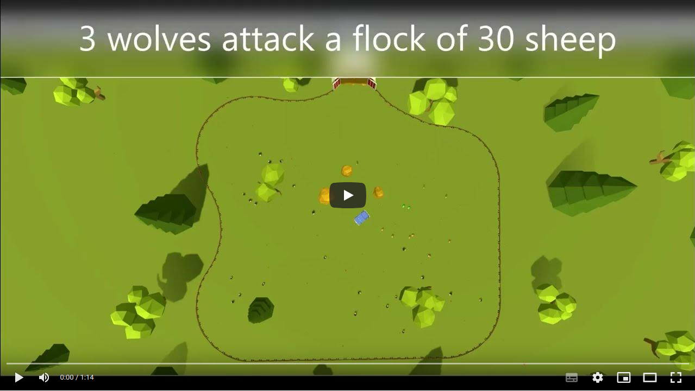

# Wolf Attack on Flock of Sheep Procedural Animation and Effectiveness of Guard Dogs

## About
Following the recent return of wolves in Slovenian forests, there is talk about attacks on farm animals. This has inspired us to develop a simulation of a wolf attack on herds of sheep, 
which is protected by a number of guard dogs. We notice an emerging group behaviour by defining the needs and rules of individual autonomous agents (sheep, dogs and wolves). 
With our simulation, we tested the effectiveness of guard dogs. To make our simulation as realistic as possible, we improved already existing solutions for herd and predator behaviour.
The final project for the Collective Behaviour course at the University of Ljubljana Faculty of Computer and Information Science in the year 2019/2020.

## Contributions
Our implementation is based on the FRIsheeping project made with the Unity game engine. 
It presents a 3D scene of an enclosed pasture and simulates a flock of sheep being herded back into a barn by several dogs with the Strömbom algorithm [1]. 

We upgraded the obstacle avoidance system of all animals and replaced the initial force field model with our implementation that finds the first available direction with a sphere cast, 
similarly to the steer-to-avoid approach described by Reynolds in his seminal "Boids" article [2]. 
Our model is more realistic and removes many drawbacks of the force field model pointed out by Reynolds in his article. 

With the addition of wolves to the simulation we implemented several wolf attacks tactics, both individual (attack the closest or the most isolated prey) 
and group approaches (surround sheep with adjusted Strömbom model - herd the flock toward the wolfpack centre or adjusted boids model with an added force vector that steers a wolf towards the prey - described by Rakušček [3])

The guard dogs can defend the flock in a more defensive (try to intercept and position themselves between the wolves and their prey) 
or an aggressive approach (chase the wolf away from the flock and keep it pinned at a distance). 
When wolves are not present in close vicinity they herd the sheep into a tighter group which is easier to defend. 

After extensive experimentation, we concluded that the best hunting tactic for the wolves is an adjusted boids group hunting model.
While guard dogs cannot completely prevent a wolf attack, they can significantly reduce the number of sheep casualties. We also note that they are most successful when they act more aggressively. This coincides with real-life observations [4].

The file "porocilo.pdf" contains a more detailed report in the Slovenian language.

A demo video can be seen bellow:

## Running the experiments
* To run the automatic testing open the project in Unity version 2019.2.9f1 or import it into a newer version.

* Open a scene named *Game*, located in Assets/Scenes/. 
* You can adjust the parameters of the simulation in the *GameManager.cs* script which is added to the *GameManager* object. All parameters are descriptively named. 
Some of the more interesting parameters are:`NOfSheep` in the *Sheep* section, `AT` (chosen attack tactic) in the *Wolf Attack* section and `AttackTactic` (use interception of wolves) in the *Guard Dog* section. 
* To change the number of wolves or guard dogs just copy and paste them into the scene.
###
* Once you are happy with simulation parameters you can adjust parameters for automatic testing in *Tester.cs* script which is also added to the *GameManager* object.
* Specifiy the `Time Per Simulation` in seconds.
* Specify `Path` to the file and `File name` that will contain the results of the testing. 
**Important:** Each automatic testing will append the results to the end of the file.
* To set the number of simulations to be run, open the *SimulationNumber.cs* script in Assets/GameManager/Scripts/, edit the *n* variable and save.
###
* When you are ready to begin testing simply play the scene and wait until it stops. 
* The results file will contain a header of simulation parameter values and time stamps (in seconds) for killed sheep separated by "----" for each new simulation iteration.
###
* You can also use a python script *parse<area>.py* located in the Assets/TestResults to analyse the collected data.

## Authors
* Ivan Antešić (ivan.v.antesic@gmail.com) 
* Adam Prestor (adam.prestor@gmail.com)

## Literature
[1] Strömbom D et al. (2014) Solving the shepherding problem: Heuristics for herding autonomous, interacting agents. Journal of The Royal Society Interface

[2] Reynolds CW (1987) Flocks, herds and schools: A distributed behavioural model. SIGGRAPH Comput. Graph. 21(4):25–34

[3] Rakušček E (2018) Ph.D. thesis (Univerza v Ljubljani)

[4] Landry J (2014) The canovis project: studying internal et external factors that may influence livestock guarding dogs’ efficiency against wolf predation. preliminary results and discussion
